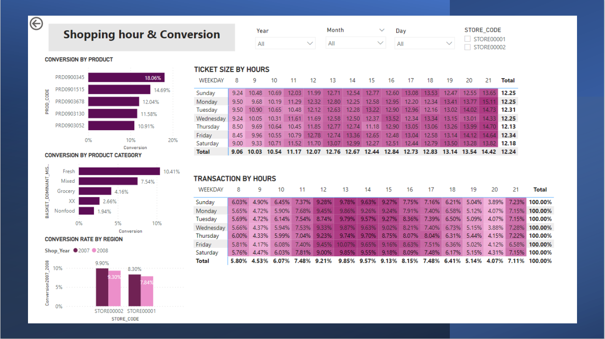
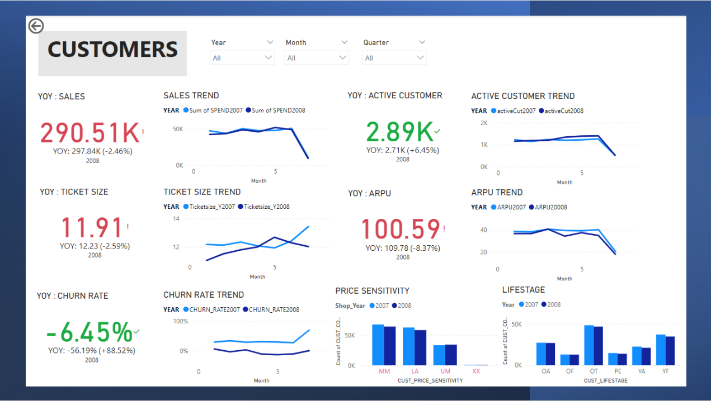
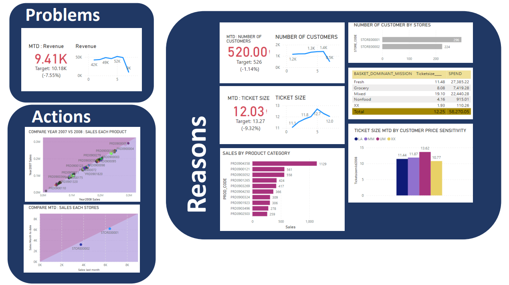
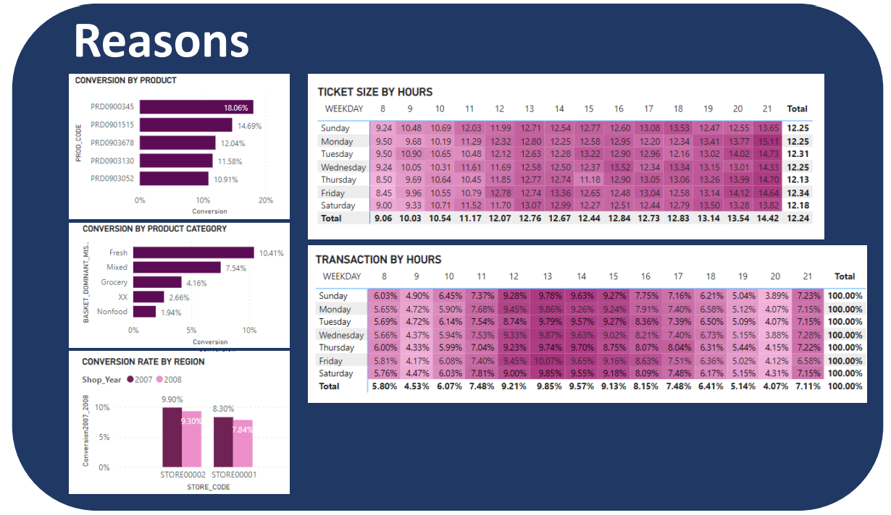
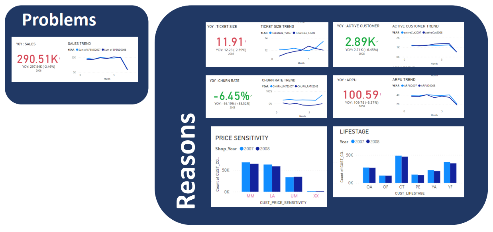

# CLV Dashboard
   
  
**Objective**	: Using Supermarket Data for data visualization Perform a Customer Lifetime Value (CLV) analysis.  
**Dataset** :	Supermarket data contains 956K historical data from only 2 stores from 2006 to 2008.  
**Technique**	: Power BI Make Dashboard.  
**Performance Measurement**	: Find the Problem , Find the Reason, Solve the problem by Find the Action.  
  
## About This DashBoard
This dashboard generated from 2016 - 2017 supermarket sales dataset.  
This dashboard is made for stakeholders such as marketing, sales, executives, etc. to support decision-making quickly and comprehensively to visualize design thinking principles.  
1.**See** is to let the dashboard user see the Problems.  
2.**Think** is to make dashboard users see Reasons.  
3.**Do** is to make dashboard users see Actions.  
for their decision The dashboard also has slicers that can drill down into focus timeframes such as Year, Quarterly, Monthly, Weekly, Daily, Hourly.  
  
  
## Sales

## Shopping Hours

## Customers

# How to use Dashboard? 
Use dashboard integration with Design Thinking.  
1. See => Problems  
The dashboard has to make the problem visible to users. From this dashboard, the problem is caused by a drop in sales for both MTD and YOY.  
  
2.think => Reasons  
Dashboards need to make users think quickly. causing the reason for the problem, which from this dashboard is caused by many factors, as follows:  
1. The number of customers decreases MTD but the number of customers increases YOY.    
2. Ticket size is reduced for both MTD and YOY.  
3. Churn rate decreases YOY.  
4. ARPU (Average Revenue Per User) decreases YOY.  
5. Price sensitivity slightly decreased, YOY for all groups.  
6. Lifestage Slightly reduced YOY in all groups.  
7. Conversion rate for both stores has decreased YOY.  
  
3.Do => Actions  
The dashboard must give the user an idea of ​​what needs to be done to solve the problem. This dashboard is displayed using scatter plots.  
1. Sales of both stores are below the threshold.  
2. Comparison of sales of all products found that all items dropped slightly below the threshold.  

## About Sales Dashboard

## About Shopping Hours Dashboard

## About Customers Dashboard

