# Campaign Response Model
         
  
**Notebooks:** [Customers Segmentation](./03_Product_Recommendation.ipynb)  
**Google Colab:**  

## Dataset
A Retail-like dataset.There are 2 datasets: 
1. Retail_Data_Response dataset consisting of customer_id, response => Customer level 
2. Retail_Data_Transactions dataset consisting of customer_id, trans_date, tran_amount => Transaction level. The table doesn't have trans_id, so we use tran_date as an identifier instead. If we want these 2 tables to join together, we can't do it at different levels. We have to make it a Customer level so that we can combine them to get into the model.

## Step of Campaign Response Model
  
### 1.Explore data
   1. EDA  
  
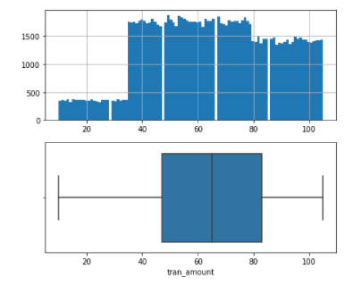  
  
  
  
   2. Cohort Analysis  
  
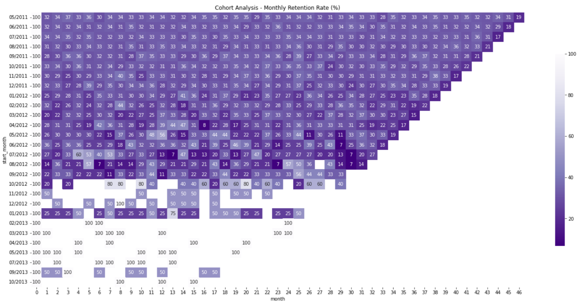  
  
  
  
## 2 Feature Engineering  
**1. Features**
  
* `recency` : the range from the last day that the customer arrived with the current day, representing *Recency* in RFM analysis.  
* `Frequency` : total distinct transactions over all 'active' , representing *Frequency* in RFM analysis.  
* `TotalSpend` : total spending over all 'active', representing *Monetary* in RFM analysis.  
* `Ticket_size` : total spending over all transactions, representing *Monetary* in RFM analysis.  
* `AOU` : See how long this customer has been a customer., representing *Tenure*.  
* `Conversion_rate` : percentage of visitors to your channel that complete a desired goal (a conversion) out of the total number of visitors., representing *conversion*.  
  
**Correlation**  
  

  
**2. Evaluate models (1st Round)**

**2.1 Creating train and test dataset**
  

  
  
  
**2.2 Use 'SMOTE' fix SMOTE (synthetic minority oversampling technique) is one of the most commonly used oversampling methods to solve the imbalance problem. It aims to balance class distribution by randomly increasing minority class examples by replicating them.**
  
  
  
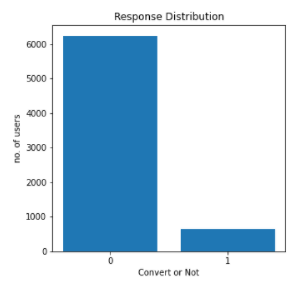  
  
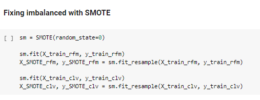  
  
  
  
**2.3  Model Selection**  
Comparison Model by **Accuracy score**
    - LogisticRegression  
    - DecisionTreeClassifier  
    - KNeighborsClassifier  
    - RandomForestClassifier  
    - GradientBoostingClassifier  
    - XGBClassifier  
  
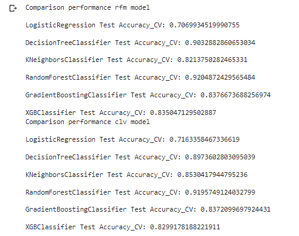  
  
#### **RFM Dataset** 
  
  
  
  
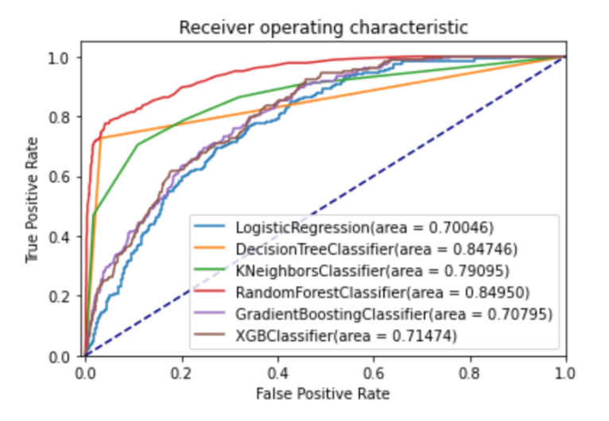  
  
  
#### **CLV Dataset** 
  
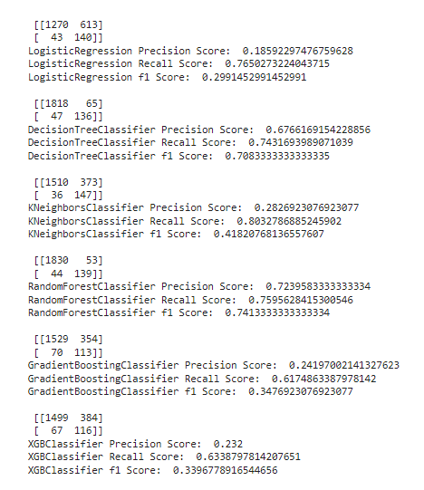

  
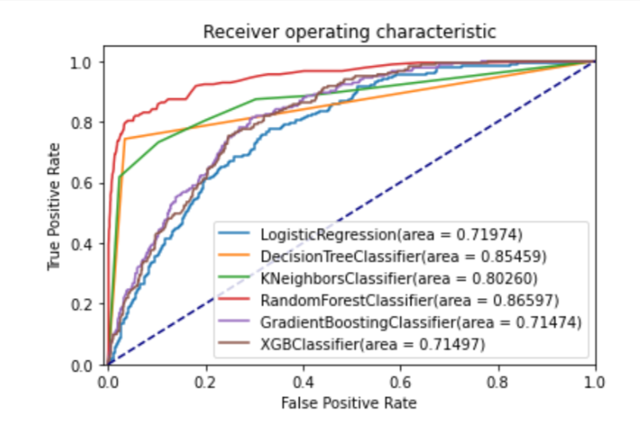
  

  
##  3.Model XGBoost
1. Before hyper parameter tunning  
  
**RFM  SMOTE**  
AUC score training set = 0.7276  
AUC score test set = 0.7043  
  
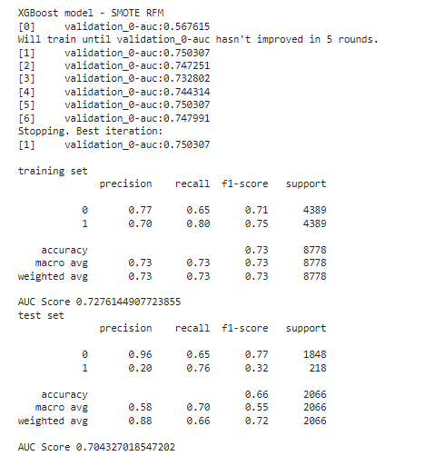  
  
**CLV  SMOTE**  
AUC score training set = 0.7276  
AUC score test set = 0.7043  
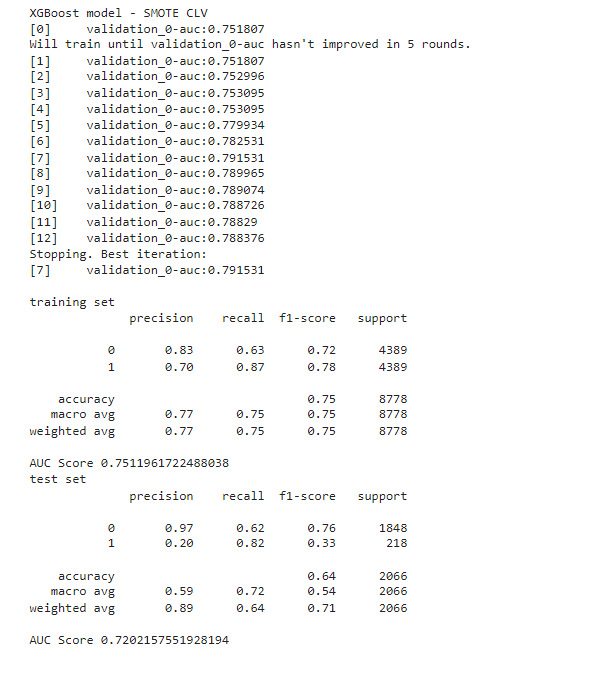  
  
  
2. Hyperparameter Tunning Model  
Use GridSearchCV()  
  
**RFM  SMOTE**  
AUC score training set = 0.7807
AUC score test set = 0.7201  
  
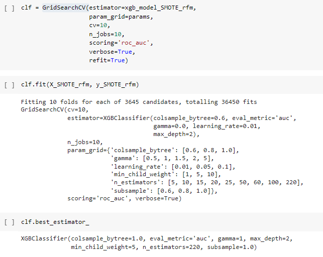  
  
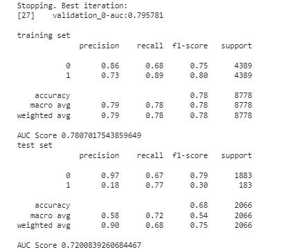  
  
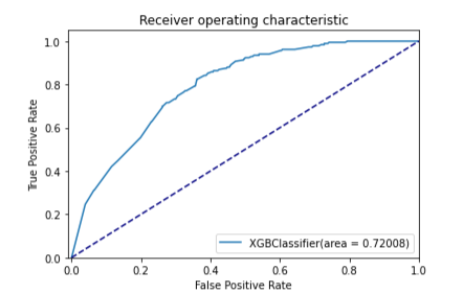  
  
  
  
**CLV  SMOTE**  
AUC score training set = 0.7886  
AUC score test set = 0.7436  
  
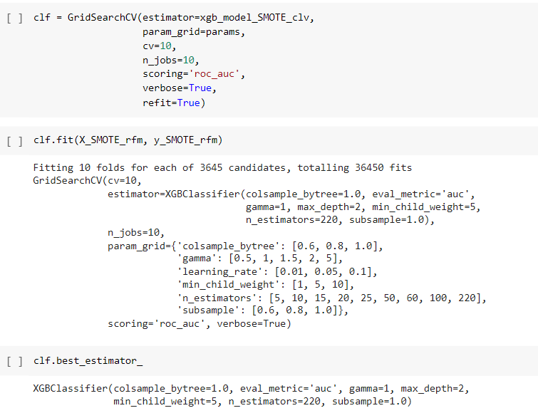  
  
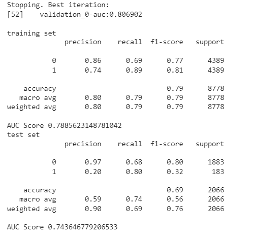  
  
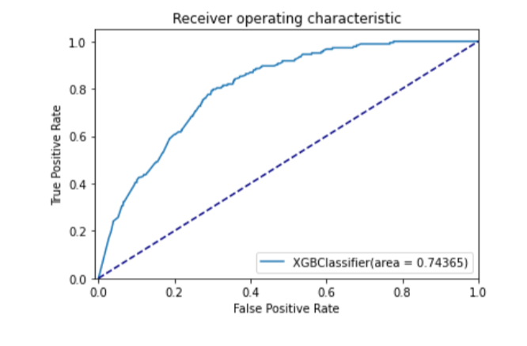  
  
  
## 4.Result
From the campaign response data, the results were obtained after the run model. Better results were obtained after using model selection and hyperparameter tuning to determine the best parameters and the AUC score was greatly improved.  
  
Targeting the most potential customers will help to maximize campaign’s ROI. To put it in numerical terms, if targeting the wrong customers can have a negative impact on reputation.
However, what is more interesting about this kind of problem is the imbalance between the positive responses versus the negative responses.in this problem, driving the models towards negative predictions, as a naive guess of all responses are negative will have a low error score. This is called the “imbalance class” problem.

  
  
