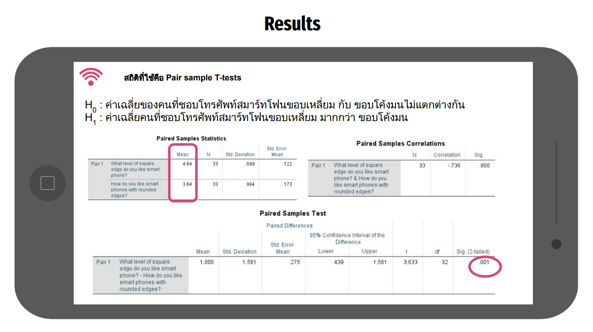
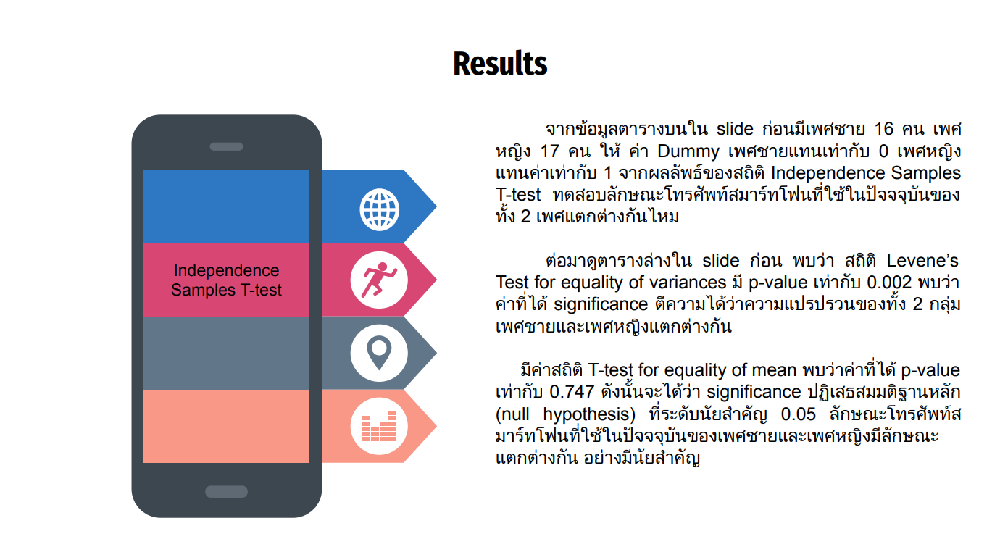
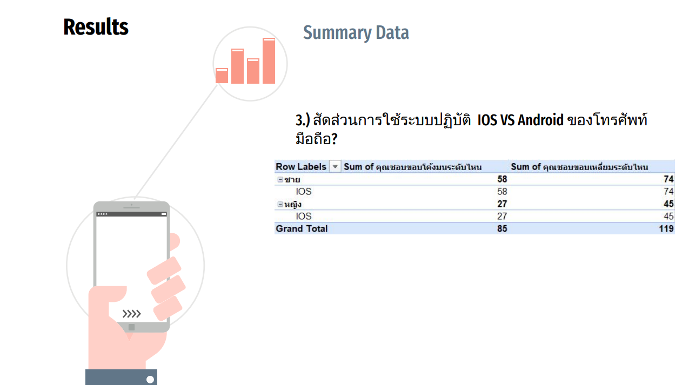

# A/B Testing
      

## Overview  
Conduct an A/B Testing by Survey method on surveying whether you prefer a smartphone with a rounded edge or a square edge.    
  
Since Apple released the iPhone 12, there has been much debate as iPhones revert to the square edge format. Some people like rounded edges. Hence the origin of this survey.    

## Dataset   
We used Google Forms to survey the data. The questionnaire was divided into personal data and smartphone usage data. To compare the preferences of using smartphones with curved or rounded edges with a 5-scale response.  

## Result  
From the summary of survey data collection using  
1. Use Pair sample T-tests statistics to test the average of people who like smart phones with square edges and rounded edges, is there any difference?  
2. Use the Independence Samples T-tests statistics to test the average of the respondents. Is there a difference between male and female models of smartphones in use today?  

  
